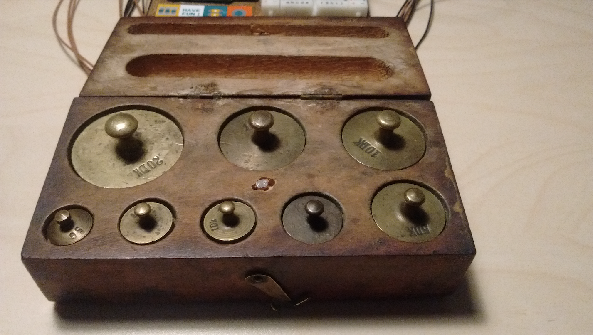
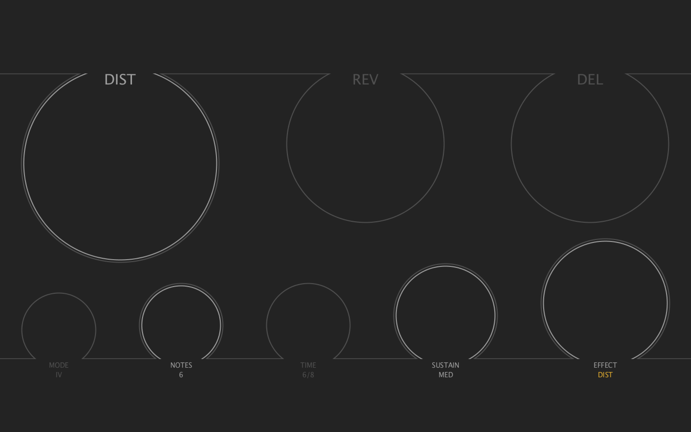

Musical Weights is an interactive instrument consisting of a box of eight brass weights, repurposed into a digital audio interface. This project was conducted for a creative programming assignment, following a brief to give a second life to a piece of “cruft”. The box outputs arpeggios, the parameters of which are controlled by the brass weights.

